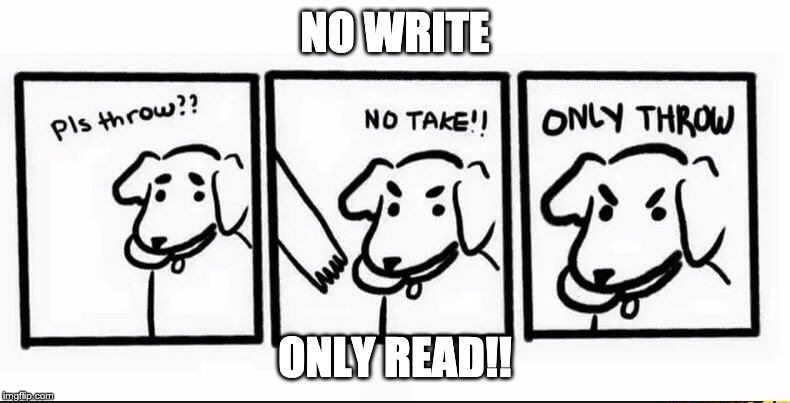
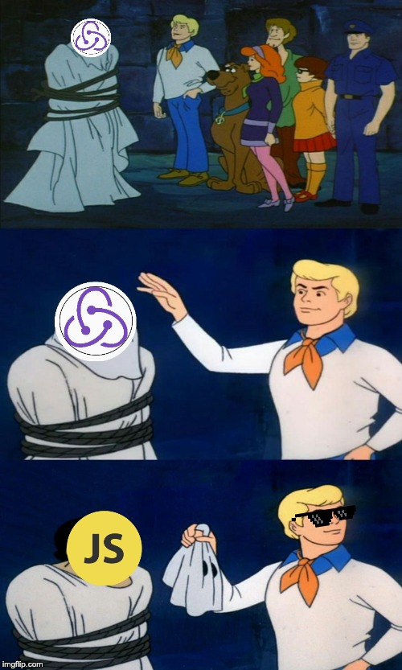

import { Head, Notes, Appear } from 'mdx-deck'

import { Split } from 'mdx-deck/layouts'

import { CodeSurfer } from "mdx-deck-code-surfer";
import vsDark from "prism-react-renderer/themes/vsDark";

import ImageCarousel from './code/ImageCarousel.jsx'
import { Provider } from 'react-redux'
import ReduxCounter from './code/ReduxCounter.jsx'
import { store } from './code/ReduxCounter.jsx'

<Head>
  <title>Level Up! '19</title>
  <link rel="icon" type="image/png" sizes="32x32" href="./images/favicon-32x32.png"/>
</Head>

## Demystifying Redux

#### Deepak Jayaram
#### VT Maple Script

<Notes>
  <ul>
    <li>Good Morning guys! Thank you for coming to my session!</li>
    <li>definitely a clickbait title - there's a lot to talk about redux that that would not fit in 55 minutes </li>
    <li>So, today, let's talk about what redux is, what problems does it solve, the 3 driving principles and what components support these principles</li>
    <li>There's some amazing documentation online about the API - at the end of the day all I hope to achieve is that if you're looking through code and you see something called reducers or actions - you know on a high level 
      what this piece of code does</li>
      <li>The link to the slide deck is on microsoft teams - no login or microsoft office needed. Feel free to stop me at any time during the presentation to ask questions!</li>
  </ul>
</Notes>

---

<ImageCarousel/>

<Notes>
  <ul>
    <li>what a time to be alive!! There's one every week!</li>
    <li>They're efficient and performant</li>
    <li>cool features like react has shadow dom and reusable components, Angular's got two way binding, support for progressive web apps out of the box, Backbone's a dumpster fire</li>
    <li>But they've all got one thing in common - they've got to store, manage, represent and share data between their components in some form</li>
    <li>For the sake of our topic today, let's zero in on one </li>
  </ul>
</Notes>

---

import ReactCounter from './code/ReactCounter';

export default Split

<ReactCounter />

  <h4> Let's look at React.. </h4>
  <ul>
      <li style={{paddingBottom: "5px"}}>UI = fn(State)</li>
      <li style={{paddingBottom: "5px"}}>Components internally manage their state</li>
      <li style={{paddingBottom: "5px"}}>As applications grow bigger, managing states shared across components becomes a chore</li>
      <li style={{paddingBottom: "5px"}}>Confusing to know where a state should live</li>
  </ul>

<Notes>
  <ul>
    <li>with around 125,000 stars on github, and used in about a million sites worldwide - React is the framework of choice here at DDC </li>
    <li>The heart of every React component is its “state”, an object that determines how that component renders & behaves. In other words, “state” is what allows you to create components that are dynamic and interactive. </li>
    <li>there can be multiple components and State can be set on each of these</li>
    <li>As applications grow bigger, managing states shared across components becomes a chore - what if I wanted to share the count with another component? and I totally can using props -(talk about props) </li>
    <li>Basically, the state will have to be lifted up to the nearest parent component and to the next until it gets to an ancestor that is common to both components that need the state and then it is passed down. This makes the state difficult to maintain and less predictable. It also means passing data to components that do not need such data.</li>
    <li>Prop drilling (also called "threading") refers to the process you have to go through to get data to parts of the React Component tree. As an application grows, you may find yourself drilling through many layers of components. parent can’t pass a prop directly to one of its grandchildren it needs to go through other components on its way down. </li>
    <li>Questions like can I safely update/ delete this component without causing stuff to blow up?</li>
  </ul>
</Notes>

---

<CodeSurfer
  style={{background:"green"}}
  code={require("raw-loader!./snippets/reactCounter.snippet")}
  title="Simple Counter"
  lang="jsx"
  notes="overview"
  theme={vsDark}
  showNumbers
  steps={[
    { range: [5, 8], notes: "local state" },
    { range: [10, 15], notes: "increment function" },
    { tokens: {11: [1,2,3]}, notes: "setState" },
  ]}
/>

<Notes>
  <ul>
    <li>setState is the only legitimate way to update state after initial startup\</li>
    <li>we’re passing an object to setState(). The object contains the part of the state we want to update which, in this case, is both the counter and the rotation</li>
    <li>This basically kicks off a process that React calls reconciliation. The reconciliation process is the way React updates the DOM, by making changes to the component based on the change in state.</li>
    <li>real gotcha - setState is asynchronous - so, do not rely on this.state immediately after calling setState </li>
  </ul>
</Notes>

---

export default Split

  

    
  

  

    
  

  <h4> Enter Flux </h4>
  <ul>
      <li style={{paddingBottom: "5px"}}>Application architecture that Facebook uses for building client-side web applications</li>
      <li style={{paddingBottom: "5px"}}>Utilizes a unidirectional data flow</li>
      <li style={{paddingBottom: "5px"}}>Dispatcher -> Store -> Controller Views ->  View</li>
  </ul>

<Notes>
  <ul>
    <li>A unidirectional data flow is central to the Flux pattern</li> 
    <li>In that diagram, there are components called store, action, view etc  - that I don't wanna go into but I wanted to mention flux because it inspired better state management libraries</li>
    <li>>when it came out - it was met with a ton of praise but there was considerable criticism - A Lot of moving parts and learning curve was substantial </li>
  </ul>
</Notes>

---

<Notes>
  <ul>
    <li>Wanting to redo the flux architecture, Dan Abromov wrote redux in 2015 (Redo + Flux => Redux)</li>
    <li>Redux is a predictable state container for JavaScript apps</li>
    <li>It's is a very small library (2kb) that gives you tools to achieve a better state management in javascript applications</li>
    <li>predictable means applications behave consistently</li>
    <li>An important point to note is that redux does not depend on react - works with any UI layer </li>
    <li>Let's look at the three principles and some of the core components of Redux </li>
  </ul>
</Notes>

---

export default Split

 

### Single source of truth

<Notes>
  <ul>
    <li>The state of your application is going to be represented as a single JavaScript object - in Redux, it's kept in an another object called a store</li>
    <li>A single state tree makes it easier to debug or inspect an application - we'll get to it soon</li>
    <li>This makes it easy to create universal apps, as the state from your server can be serialized and sent the client with no extra coding effort</li>
    <li>it also enables you to persist your app's state in development, for a faster development cycle </li>
  </ul>
</Notes>

---

<CodeSurfer
  code={require("raw-loader!./snippets/singlesource.snippet")}
  title="Single Source of Truth"
  notes="overview"
  theme={vsDark}
  showNumbers
  steps={[
    { lines: [1], notes: "API method for accessing the entire state of the application" },
    { range: [3,15], notes: "prints the entire state object" },
  ]}
/>

---

export default Split

 

### State is read-only

<Notes>
  <ul>
    <li>The only way to change the state is to emit something called an action, an object describing what happened</li>
    <li>An action is a plain JavaScript object, describing in the minimal way what changed in the application. </li>
    <li>Whether it is initiated by a network request or by user interaction, any data that gets into the Redux application gets there by actions - Creating an action expresses an intent to modify the state</li>
    <li>Let's look at what actions are </li>
  </ul>
</Notes>

---

<CodeSurfer
  code={require("raw-loader!./snippets/actions.snippet")}
  title="Actions"
  notes="overview"
  lang="javascript"
  theme={vsDark}
  showNumbers
  steps={[
   { tokens: {2: [0, 1, 2, 3, 4, 5, 6], 7: [0, 1, 2, 3, 4, 5, 6, 7]}, notes: "Actions MUST have a type property set" },
   { tokens: { 7: [ 2, 3, 4, 5, 6, 7]}, notes: "Note that 'type' must be string" },
  ]}
/>

<Notes>
  <ul>
    <li>They're just plain objects</li>
    <li>Actions must have a type property set - why? remember flux? the framework from which redux was inspired? The Flux Standard Action format for defining actions as "type, payload, error" was inherited from flux</li>
    <li>Having this property required by convention keeps the code clean and consistent</li>
    <li>Type property is generally a string - this is for serialization. Object serialization is the process of converting an object’s state to a string from which it can later be restored.</li>
    <li>How can i create actions? </li>
  </ul>
</Notes>

---

<CodeSurfer
  code={require("raw-loader!./snippets/actioncreators.snippet")}
  title="Action Creators"
  notes="Functions that create actions  &nbsp; 🤷"
  lang="javascript"
  theme={vsDark}
/>

<Notes>
  <ul>
    <li>How are actions created? using an Action Creator!</li>
    <li>Action creators are exactly that—functions that create actions.</li>
    <li>they're invoked from the view in response to a user input or a network response </li>
    <li>You cannot modify the state directly but Creating an action expresses an intent to modify the state</li>
    <li>Hey I just created an action - how does this modify state? - well - let's look at the third and final principle of redux</li>
  </ul>
</Notes>

---

export default Split

 

### Changes are made with pure functions

---

<CodeSurfer
  code={require("raw-loader!./snippets/purefunctions.snippet")}
  title="Pure vs Impure Functions"
  notes="overview"
  theme={vsDark}
  showNumbers
  steps={[
    { range:  [2, 4], notes: "square() is predictable" },
    { range:  [11, 14], notes: "whereas, this one's not" },
    { range:  [6, 8], notes: "squareAll returns new array" },
    { lines: [6, 7, 8,  16, 17, 18, 19, 20], notes: "Compare that to the impure version of the same function"  },
  ]}
/>

<Notes>
  <ul>
    <li>Pure functions are functions that have a predictable outcome</li>
    <li>Pure functions do not have any observable side effects, such as network or database calls. You can be confident that if you call the pure function with the same set of arguments, you're going to get the same returned value. </li>
  </ul>
</Notes>

---

export default Split

  <h4>Reducers</h4>
  <ul>
      <li style={{paddingBottom: "5px"}}>function(previousState, action) => newState</li>
      <li style={{paddingBottom: "5px"}}>"Given a set of inputs, it should always return the same output. No surprises, No side effects. No API calls. No mutations"</li>
      <li style={{paddingBottom: "5px"}}>Writing clean reducers result in code that is easy to maintain, test and debug</li>
  </ul>

<Notes>
  <ul>
    <li>And now we focus on the last of the core components: reducers - they're kinda like the rockstar of redux world</li>
    <li>Like The humble coffee maker which takes in coffee powder and water and returns a freshly brewed cup of coffee - Reducers are pure functions that take in a state and action and return a new state. </li>
    <li>Redux checks whether the old object is the same as the new object by comparing the memory locations of the two objects.  So if you mutate the old object’s property inside a reducer, the “new state” and the “old state” will both point to the same object. Hence Redux thinks nothing has changed!</li>
    <li>there is only one way to know if two JavaScript objects have the same properties. To deep-compare them. But this becomes extremely expensive in large real-world apps. So one work around is to have a policy to ask developers to create a new object whenever there is a change, then send it to the framework. And if there are no changes, then send back the old object as it is. In other words, new objects represent new states.</li>
  </ul>
</Notes>

---

<CodeSurfer
  code={require("raw-loader!./snippets/reducers.snippet")}
  title="Reducers"
  notes="overview"
  theme={vsDark}
  showNumbers
  steps={[
    { tokens:  {1: [4, 5, 6]}, notes: "Takes in the previous state" },
    { tokens:  {1: [8]}, notes: "and an action" },
    { lines:  [2, 3, 8], notes: "Looks at the action.type" },
    { lines:  [4, 5, 6, 7, 9, 10, 11, 12], notes: "Business logic" },
    { range:  [13, 15], notes: "always return a state" },
  ]}
/>

<Notes>
  <ul>
      <li>It’s common to use a switch statement with cases for each action you want to handle.</li>
      <li>have a default state - This is important, because Redux can (will) call your reducer with actions that it doesn’t know what to do with. </li>
      <li>you can have multiple reducers in an application - techniques on how to work with multiple reducers are available in the redux documentation</li>
  </ul>
</Notes>
---

export default Split

 

<ul style={{padding: "50px", textAlign: "left"}}>
  <Appear>
    <li style={{paddingBottom: "5px"}}>The state of your application is stored in a single object - Single source of truth</li>
    <li style={{paddingBottom: "5px"}}>Actions are plain objects & Action creators create actions</li>
    <li style={{paddingBottom: "5px"}}>You cannot modify state directly, you've got to create an action - State is read-only</li>
    <li style={{paddingBottom: "5px"}}>Pure Functions are functions that have a predictable outcome</li>
    <li style={{paddingBottom: "5px"}}>Changes to the state are made using Reducers - which are pure functions</li>
  </Appear>
</ul>

---

---
export default Split

<Provider store={store}>
    <ReduxCounter />
</Provider>

<ul style={{padding: "50px", textAlign: "left"}}>
  <h4> We meet again.. </h4>
    <li style={{paddingBottom: "5px"}}><a href="http://extension.remotedev.io/#installation" target="BLANK">Download Redux Dev Tools Here</a> (opens in a new window)</li>
</ul>

---

export default Split

 

<ul style={{listStyle: "none", textAlign: "left"}}>
  <h2>Resources</h2>
  <li style={{paddingBottom: "25px"}}><a href="https://redux.js.org/" target="BLANK">Redux JS Official Website</a></li>
  <li style={{paddingBottom: "25px"}}><a href="https://overreacted.io/" target="BLANK">Dan Abramov's Blog</a></li>
  <li style={{paddingBottom: "25px"}}><a href="https://github.com/jxnblk/mdx-deck" target="BLANK">MDX Deck</a></li>
  <li><a href="https://github.com/pomber/code-surfer" target="BLANK">Code Surfer</a></li>
</ul>

---

## Thank you!
